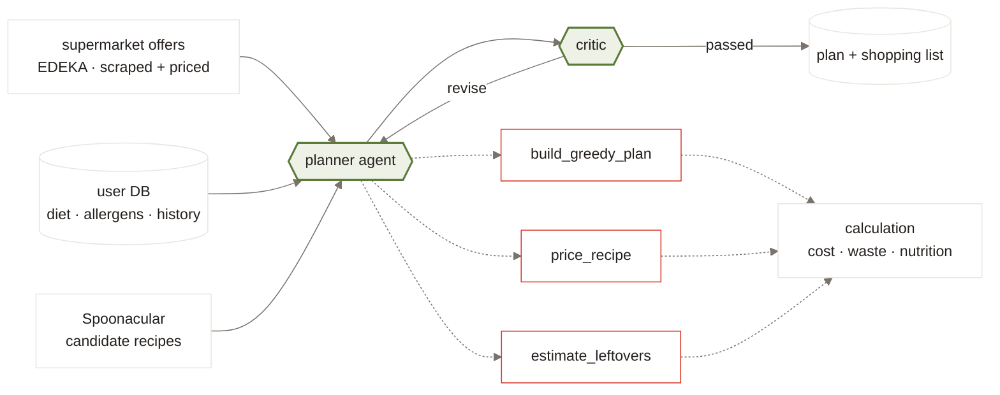
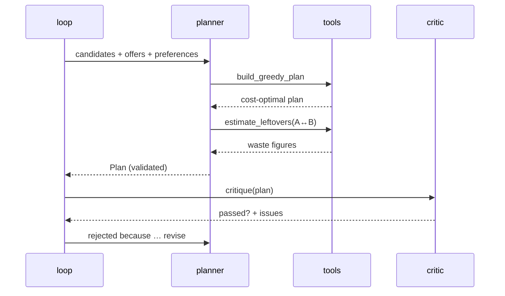

# CheapRecipe

## Cook what's on offer

<div class="muted mt-8 text-lg">
A weekly meal plan built from this week's supermarket discounts —<br>
cheapest basket, least waste, actually edible.
</div>

---
layout: section
class: section
---

# The idea

---

# The problem is arithmetic, not inspiration

Every week EDEKA publishes a flyer. This week's had:
<div grid="~ cols-2 gap-8" class="mt-8">
<div>

<div class="mt-6">
  <div class="stat text-6xl">165</div>
  <div class="muted">discounted items</div>
</div>

<div class="mt-6">
  <div class="stat stat-save text-6xl">84</div>
  <div class="muted">usable ingredients after cleaning</div>
</div>

</div>
<div v-click>

Planning around them by hand means answering:

- which recipes use the **most** discounted items?
- which combination leaves the **least** half-used?
- does any of it fit a diet, a budget, an allergy?

<div class="card mt-6">
That is a <strong>set-cover problem over a weekly-changing dataset</strong>.<br>
Nobody does it in their head. Most people buy the deal and throw half of it away.
</div>

</div>
</div>

---

# What it produces

<div class="card mt-4">

**Input** — one market id, a diet, a number of meals

**Output** — n recipes, one shopping list, one price

</div>

<div grid="~ cols-3 gap-4" class="mt-8">
<div class="card" v-click>
  <div class="muted text-sm">Basket total</div>
  <div class="stat text-4xl mt-1">27,72 €</div>
</div>
<div class="card" v-click>
  <div class="muted text-sm">You save</div>
  <div class="stat stat-save text-4xl mt-1">9,28 €</div>
</div>
<div class="card" v-click>
  <div class="muted text-sm">Leftovers</div>
  <div class="stat text-4xl mt-1">3,62 €</div>
</div>
</div>

<div v-click class="mt-8 muted">
The third number is the one that makes this different from a coupon app.
Buying a 500 g pack to use 150 g is not a saving.
</div>

---
layout: section
class: section
---

# Architecture

---

# Everything the planner is connected to



<div class="mt-2 text-sm" v-click>

Three sources in, one plan out. The <span class="pill">green</span> boxes are the only
two places a model is used; the <span style="color:#D8382A;font-weight:600">red-edged</span>
tools are deterministic, and every number on the plan comes through them.

</div>

---

# The data is messier than it looks

<div grid="~ cols-2 gap-6" class="mt-4 text-sm">
<div>

Offer descriptions carry the quantity in free text:

```text
Frische französische Freilandhähnchen Label
1.19
Fleisch & Wurst
Rouge ca. 1,5 kg, HKL A, 100 g
```

```text
Starbucks Kaffee
1.49
Molkerei & Käse
versch. Sorten, 220 ml oder Frappuccino, auch Vanilla,
250 ml, koffeinhaltig, (1 L = 6,77–5,96)
```

</div>
<div>

<v-clicks>

- `100 g` with no base price means price **per** 100 g, not a 100 g pack — reading it wrong understates €/kg tenfold
- deposits are refundable, so not part of the price

</v-clicks>

</div>
</div>

<div v-click class="card mt-6">
EDEKA prints the base price on packaged goods, which doubles as an <strong>oracle</strong>:
derive it independently, compare. <span class="pill">91 / 91 agree</span>
</div>

---
layout: section
class: section
---

# How the agent works

---

# The planner is not one thing

<div grid="~ cols-2 gap-8" class="mt-8">
<div class="card">

### Greedy core
<div class="muted mb-3">deterministic</div>

Picks n recipes minimising cost + waste.
</div>
<div class="card" v-click>

### Agent
<div class="muted mb-3">pydantic-ai over OpenRouter</div>

Adjusts that plan for variety, coherence and free-text preference.

Calls the greedy planner **as a tool**.

</div>
</div>

<div v-click class="mt-8">

The greedy is not replaced by the agent — it is the agent's first tool call.

</div>

---

# Why greedy has to be stateful

<div class="mt-4">

A recipe's cost is **not a property of the recipe**. It is the cost of what still has to be bought, given what the plan already committed to.

</div>

<div grid="~ cols-2 gap-6" class="mt-6">
<div class="card" v-click>

**Recipe 1** needs 200 g onions<br>
→ buys a 500 g bag · **1,19 €**<br>
<span class="muted">300 g left over</span>

</div>
<div class="card" v-click>

**Recipe 2** needs 250 g onions<br>
→ already paid for · **0,00 €**<br>
<span class="pill">waste drops too</span>

</div>
</div>

<v-click>

```python
for _ in range(number_of_meals):
    best = min(remaining, key=lambda r: score(*basket.project(r), r))
    basket.commit(best)      # project() is pure, commit() mutates
```

Score every candidate against the *current* basket, commit the best, rescore.
Scoring once against an empty basket would optimise nothing — the overlap
between recipes is where the savings are.

</v-click>

---

# The tools

```python {all|1-2|4-8|10-12}
@agent.tool
def price_recipe(ctx: RunContext[PlanningContext], recipe_name: str) -> float:
    """Cost of one recipe on its own, in euros, at current offer prices."""
    recipe = ctx.deps.find(recipe_name)     # raises ModelRetry if unknown
    return cost.compute(recipe, ctx.deps.offers)
```

<div v-click="4" class="mt-6">

| the model sees | comes from |
|---|---|
| tool name + parameter schema | the function signature |
| what the tool does | the docstring |
| "no recipe named X, available: …" | `ModelRetry`, so it corrects itself |
| a validated `Plan` | `output_type=Plan` |

</div>

<div v-click="5" class="mt-4 muted">
Nothing is hand-written twice, so the schema and the validation cannot drift.
</div>

---

# Three tools, one rule

<div grid="~ cols-3 gap-4" class="mt-8">
<div class="card">
<div class="pill pill-deal">build_greedy_plan</div>
<div class="mt-3 text-sm">The deterministic optimum. The starting point, not the answer.</div>
</div>
<div class="card">
<div class="pill pill-deal">price_recipe</div>
<div class="mt-3 text-sm">Cost of a recipe standalone — for evaluating a swap.</div>
</div>
<div class="card">
<div class="pill pill-deal">estimate_leftovers</div>
<div class="mt-3 text-sm">Waste of a <em>combination</em>. Shared ingredients are the savings.</div>
</div>
</div>

<div v-click class="card mt-10">

**No tool does arithmetic of its own.** Every one delegates to `calculation/`.

<span class="muted">If the agent and a direct caller could disagree about what a recipe costs,
the plan stops being verifiable — and the critic's job becomes impossible.</span>

</div>

---

# The loop



<div v-click class="mt-2 card text-sm">
The <strong>loop</strong> owns the stopping decision, not the planner.
</div>

---

# What the critic judges

<div grid="~ cols-2 gap-8" class="mt-6">
<div>

### Given to it
<div class="muted text-sm mb-2">computed, never re-derived by the model</div>

<v-clicks>

- `total_cost` — from `calculation/cost.py`
- `waste_grams` — from `calculation/waste.py`
- nutrition per serving, against the user's goal

</v-clicks>

</div>
<div>

### Judged by it
<div class="muted text-sm mb-2">the reason it is an LLM</div>

<v-clicks>

- **variety** — five tomato dishes is a bad week, at any price
- **time fit** — 55 minutes on a night the user said was busy
- **skill** — is the cooking level right for this cook?
- **prep** — three recipes each needing an overnight soak
- **coherence** — does this read as a week someone would cook?

</v-clicks>

</div>
</div>

<div v-click class="card mt-6 text-sm">
None of that is a threshold. A plan can be the cheapest, least wasteful and
nutritionally fine and still be a plan nobody wants to cook —
<span class="muted">exactly the failure the arithmetic cannot see.</span>
</div>

---

# The critic's contract

```python
class Critique(BaseModel):
    passed: bool           # the verdict — the critic decides it, the loop acts on it
    total_cost: float      # handed in, echoed back so the judgement stays auditable
    waste_grams: float
    nutrition_ok: bool
    issues: list[str]      # what is wrong with this week
    suggestions: list[str] # what to try instead — fed back to the planner
```

<div grid="~ cols-2 gap-6" class="mt-6 text-sm">
<div class="card" v-click>

**The critic is an agent too.**

It is the only component that sees cost, waste *and* whether the week makes
sense together — so the verdict has to be its own.

</div>
<div class="card" v-click>

**The loop still bounds it.**

`passed` plus `MAX_ROUNDS` is the stop condition: bounded and testable, rather
than a model deciding when to stop working.

</div>
</div>

<div v-click class="mt-6 muted text-sm">
The numbers are still never invented — they arrive from <code>calculation/</code> and are
echoed back, so a critique can be checked against the plan it judged.
</div>

---
layout: section
class: section
---

# Current status

---

# What runs today

<div grid="~ cols-2 gap-8" class="mt-4 text-sm">
<div>

### Working

- **ingestion** — EDEKA offers, no credentials
- **normalization** — cleaning, quantity + price/unit, LLM translation, classification
- **selection** — use case filtering
- **matching** — Spoonacular `findByIngredients` **and** `complexSearch`
- **CLI** — `cheaprecipe offers` / `recipes`
- **frontend** — React, mock data, two-tier design system

</div>
<div>

### Skeleton

- **calculation** — signatures and primitives, bodies open
- **planner** — greedy structure + agent wiring
- **critic / loop** — typed, not implemented
- **db** — schema complete, repositories open

</div>
</div>

---

# What the data taught us

<div class="mt-6" grid="~ cols-3 gap-4">
<div class="card" v-click>
<div class="stat text-5xl">14%</div>
<div class="muted mt-2 text-sm">of ingredients came back unclassified — an 800-token cap silently truncating every batch. Found by logging attrition, not by a test.</div>
</div>
<div class="card" v-click>
<div class="stat text-5xl">3/51</div>
<div class="muted mt-2 text-sm">recipe ingredients matched our names exactly. Spoonacular answers in its own vocabulary: carrot, carrots, baby carrot.</div>
</div>
<div class="card" v-click>
<div class="stat text-5xl">7</div>
<div class="muted mt-2 text-sm">of ~200 recipe ingredient lines are in grams. The rest are cups and tablespoons — density-dependent, so not a formula.</div>
</div>
</div>

<div v-click class="card mt-8">
Every one of these was invisible until a stage logged <strong>what it dropped and why</strong>.
</div>

---

# Next

<div class="mt-8">
<v-clicks>

1. **Unit conversion** — `cup` → grams, per ingredient. Blocks every cost and waste number.
2. **Canonical ingredients** — one vocabulary both offers and recipes resolve to. Blocks matching.
3. **Finish the loop** — critic verdict deterministic, feedback threaded back to the planner.
4. **Own the recipe corpus** — a local DB turns retrieval into a `GROUP BY` and removes the quota.

</v-clicks>
</div>

<div v-click class="card mt-10">
The interesting problems left are <strong>data problems</strong>, not model problems.
</div>

---
layout: center
class: cover
---

# Thank you

<div class="muted mt-4">
github.com/nachtdenkerr/cheap_recipe
</div>
